# The Lost Souls Productions

## IV - Racer (2002)
[nfo](https://github.com/the-lost-souls/IV/blob/master/src/racer.nfo) - 
[src](https://github.com/the-lost-souls/IV) - 
[youtube](https://www.youtube.com/watch?v=mHV_oIYZyEg) - 
[scene.org](https://files.scene.org/view/parties/2002/thegathering02/demo/iv_-_racer_by_tls.zip) - 
[pouet.net](http://www.pouet.net/prod.php?which=5555)

[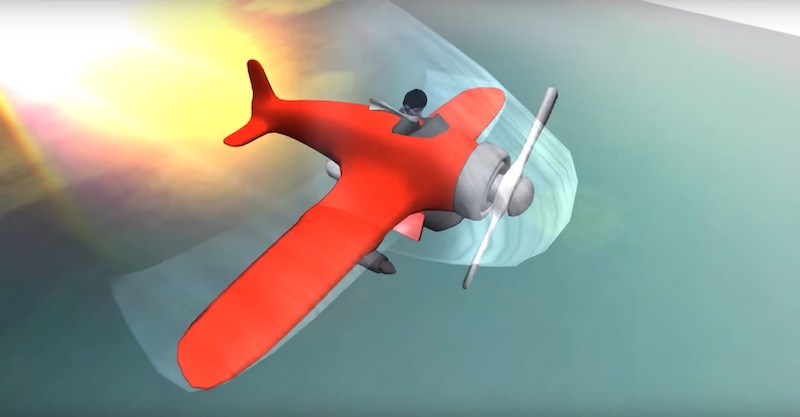](https://www.youtube.com/watch?v=mHV_oIYZyEg)

Finished 2nd at The Gathering '02 Demo Compo.

## Anytime (2001)
[nfo](https://github.com/the-lost-souls/anytime/blob/master/src/anytime.nfo) -
[src](https://github.com/the-lost-souls/anytime) - [youtube](https://www.youtube.com/watch?v=_ubBTbGcLv8) - [scene.org](https://files.scene.org/view/parties/2001/norvegia01/demo/tls-anytime.zip) - [pouet.net](http://www.pouet.net/prod.php?which=4244)

[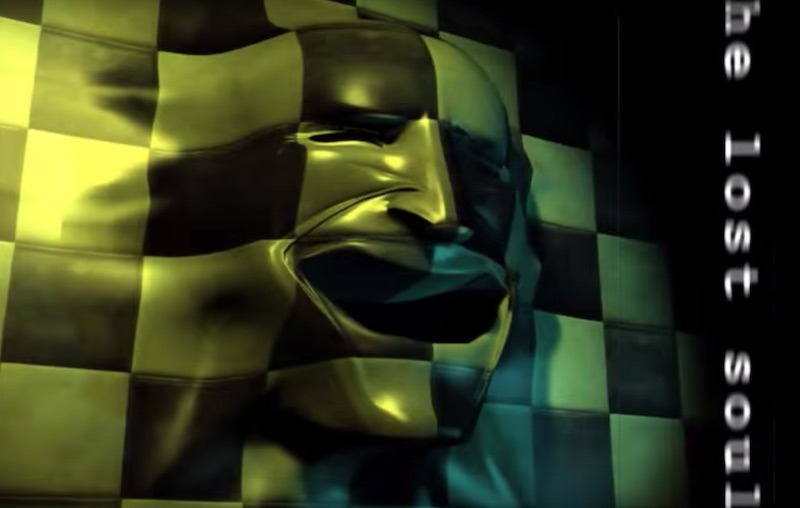](https://www.youtube.com/watch?v=_ubBTbGcLv8) 

Finished 1st at Norvegia 2001 Demo Compo.

## III - Live Tomorrow (1999)
[nfo](https://github.com/the-lost-souls/III/blob/master/src/TLS_III.NFO) - 
[src](https://github.com/the-lost-souls/III) - 
[youtube](https://youtu.be/rMkFe3xxZmA) - 
[scene.org](https://files.scene.org/view/parties/1999/thegathering99/demo/tls_iii.zip) - 
[pouet.net](http://www.pouet.net/prod.php?which=5919)

[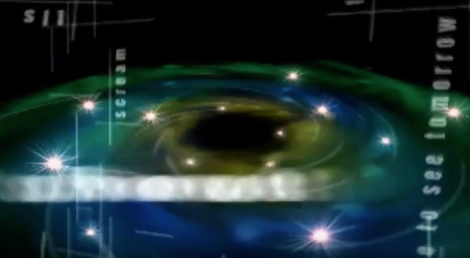](https://youtu.be/rMkFe3xxZmA)

Finished 2nd at The Gathering '99 Demo Compo.

## Cucumber Slumber (1999)
[youtube](https://youtu.be/ClB6vvaWzMg)

[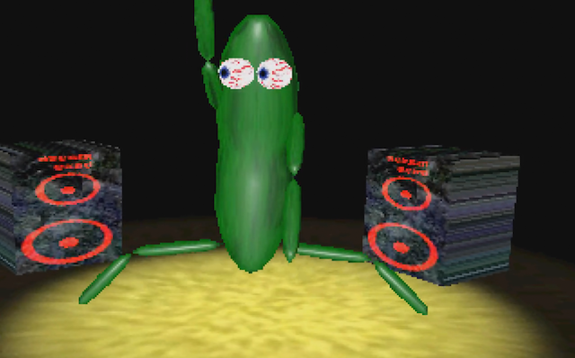](https://youtu.be/ClB6vvaWzMg)

Collaboration with ELQ, finished 1st at The Gathering '99 Fast Intro Compo (MSDOS).

## Follow your Heart (1999)
[youtube](https://youtu.be/AAPkby4EDQY)

[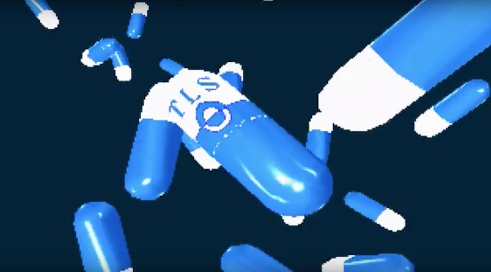](https://youtu.be/AAPkby4EDQY)

## II (1998)
[nfo](https://github.com/the-lost-souls/II/blob/master/src/TLS_II.NFO) - 
[src](https://github.com/the-lost-souls/II) - 
[youtube](https://youtu.be/stSv0y_zg1o) - [scene.org](https://files.scene.org/view/parties/1998/thegathering98/demo/tls_ii.zip) - [pouet.net](http://www.pouet.net/prod.php?which=5923)

[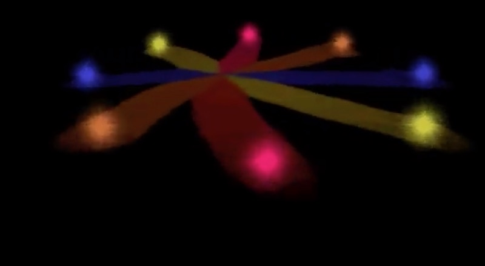](https://youtu.be/stSv0y_zg1o)

## PGP (1997)
[pouet.net](http://www.pouet.net/prod.php?which=15848)

[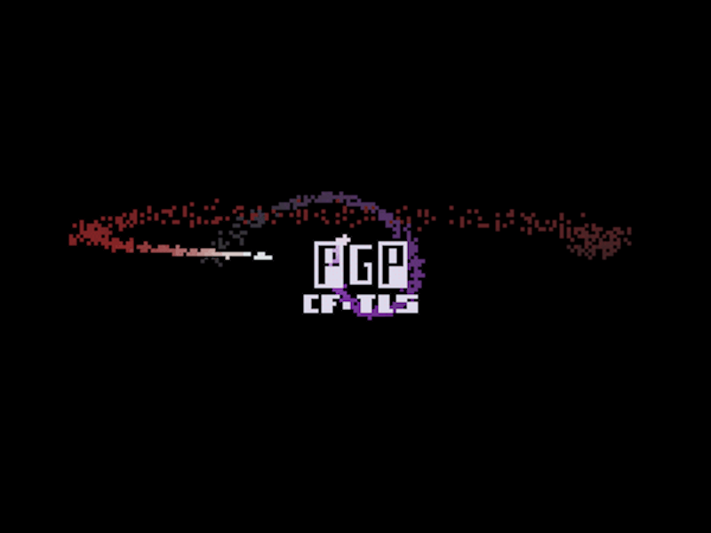]()

## Mind over Matter (1996)
[youtube](https://youtu.be/UtopQ09WZ9c) - [nfo](https://github.com/the-lost-souls/mind-over-matter/blob/master/src/MOM.NFO) - [scene.org](https://files.scene.org/view/parties/1996/gathering96/demo/tls_mom.zip) - [pouet.net](http://www.pouet.net/prod.php?which=58683) - [src](https://github.com/the-lost-souls/mind-over-matter)

[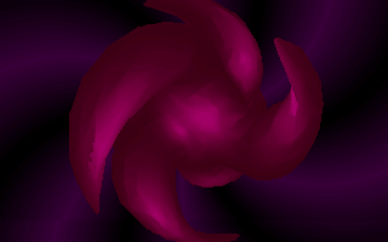]()

Finished 8th at The Gathering 1996 Demo Compo.

## Time (1996)
[youtube](https://youtu.be/AyIQb7SAhP0) - [nfo](https://github.com/the-lost-souls/time/blob/master/src/TIME.NFO) - [scene.org](https://files.scene.org/view/parties/1996/tonstad96/demo/tls_time.zip) - [pouet.net](http://www.pouet.net/prod.php?which=58684) - [src](https://github.com/the-lost-souls/time)

[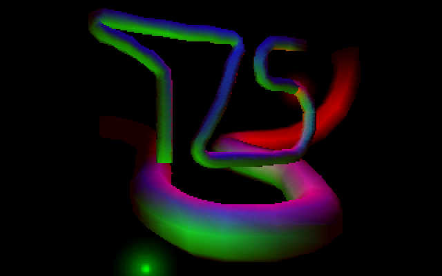](https://youtu.be/AyIQb7SAhP0)

Finished 1st at Tonstad Party '96 Demo Compo.

## Synthetic (1995)
[youtube](https://youtu.be/tJvQbS8wOok) - [nfo](https://github.com/the-lost-souls/synthetic/blob/master/src/TLS_SYN.TXT) - [download](https://github.com/the-lost-souls/synthetic/releases/download/final/SYN_TLS.ZIP) - [src](https://github.com/the-lost-souls/synthetic)

[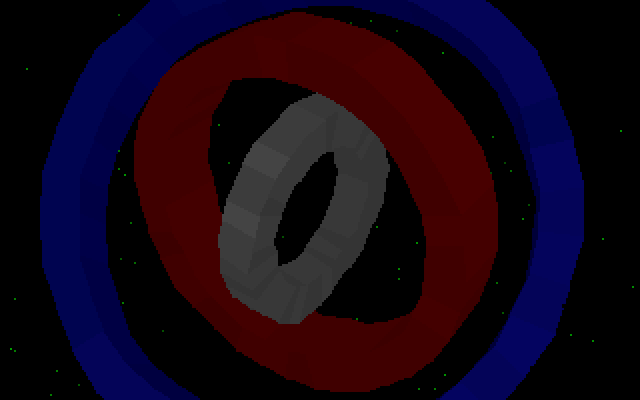](https://youtu.be/tJvQbS8wOok)

## Sorcerer BBS Intro (1995)
[youtube](https://youtu.be/F_KWflqlF1g) - [download](https://github.com/the-lost-souls/sorcerer/releases/download/final/SORCERER.zip) - [src](https://github.com/the-lost-souls/sorcerer)

[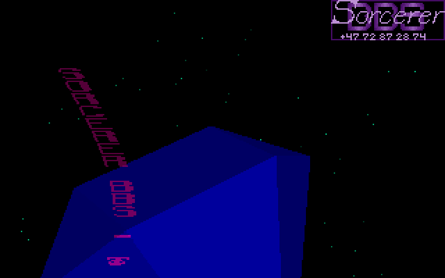](https://youtu.be/F_KWflqlF1g)

## TIß (1994)
[youtube](https://youtu.be/Qd8WPVmYhX8) - [nfo](https://github.com/the-lost-souls/TiB/blob/master/src/TLS.NFO) - 
[download](https://github.com/the-lost-souls/TiB/releases/download/final/tls_Tiss.ZIP) - [src](https://github.com/the-lost-souls/TiB)

[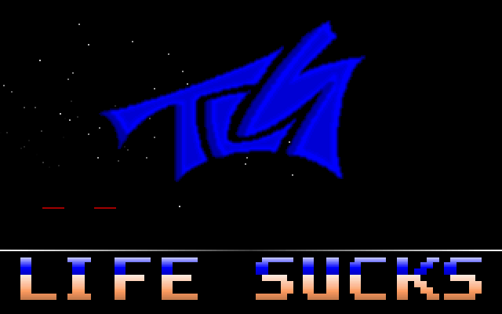](https://youtu.be/Qd8WPVmYhX8)

Demo for Melhus Party 1994.

## TLS Disk (1994)
TODO

